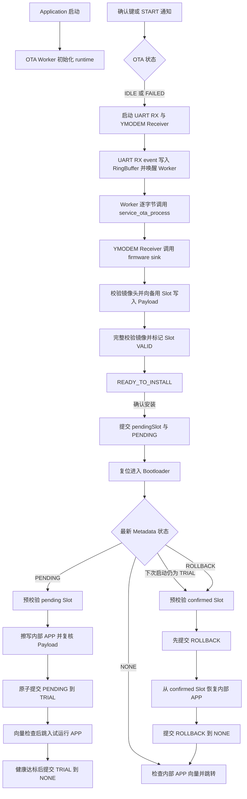

# OTA 应用与 Bootloader 源码阅读笔记

## 阅读范围

- 目标：梳理 Application OTA 的接收/验证/安装提交，以及 Bootloader 的候选安装、试运行启动选择和回滚流程。
- 已阅读：`03_Firmware/Application/OTA_APP` 的配置、runtime / worker / health、OTA/UART/YMODEM/firmware 服务及 Keil 工程引用；另阅读 `03_Firmware/Bootloader/OTA_Bootloader` 的 main、状态分支、预校验、安装器、Metadata 转换和镜像验证实现。
- 源码版本与分析日期：`HEAD=3e158807a5310c9b1289ef5d02b4e8661aaabaec`；Application / Bootloader 源码无未提交修改；2026-09-23。
- 源码引用路径：本文统一使用仓库根目录相对路径。
- 验证边界：本文是静态源码复核，本次未重跑构建或板级操作。S10 阶段验证报告记录代码验证 `PASS`、硬件验证 `PARTIAL / DEFERRED FOLLOW-UP`；本文不改变该结论，详见 `04_Test/Reports/Stages/S10_Trial_Confirm_Rollback/verification.md`。
- 未覆盖：EEPROM / Flash 写入在真实掉电瞬间的物理结果，以及本次未重跑的板级场景；相关既有验证和延期边界见 S09 / S10 验证报告。
- 报告位置：`03_Firmware/00_Doc/Module_Design/OTA应用源码阅读.md`。该目录用于记录固件模块及其依赖和接口。

## 流程概览

启动接线见 `03_Firmware/Application/OTA_APP/01_APP/system/app_system.c:141-149` 和 `03_Firmware/Application/OTA_APP/01_APP/task/app_ota_worker.c:541-573`。OTA 业务状态定义见 `03_Firmware/Application/OTA_APP/02_Service/service_ota/service_ota.h:31-42`；Bootloader 的状态选择与回滚见 `03_Firmware/Bootloader/OTA_Bootloader/Boot/boot_main.c:282-380`。

## 文件与符号索引

| 职责 | 文件 / 符号 | 证据 |
|---|---|---|
| 启动 OTA Worker | `03_Firmware/Application/OTA_APP/01_APP/system/app_system.c` / `app_ota_worker_start` | `03_Firmware/Application/OTA_APP/01_APP/system/app_system.c:141-149` |
| OTA 命令、按键与收包循环 | `03_Firmware/Application/OTA_APP/01_APP/task/app_ota_worker.c` / `app_ota_worker_entry`、`app_ota_worker_handle_key`、`app_ota_worker_process_session` | `03_Firmware/Application/OTA_APP/01_APP/task/app_ota_worker.c:261-357`、`03_Firmware/Application/OTA_APP/01_APP/task/app_ota_worker.c:379-449`、`03_Firmware/Application/OTA_APP/01_APP/task/app_ota_worker.c:541-609` |
| 外设和服务对象装配 | `03_Firmware/Application/OTA_APP/01_APP/runtime/app_ota_runtime.c` / `app_ota_runtime_init_storage`、`app_ota_runtime_init_uart` | `03_Firmware/Application/OTA_APP/01_APP/runtime/app_ota_runtime.c:67-190` |
| OTA 状态机 | `03_Firmware/Application/OTA_APP/02_Service/service_ota/service_ota.c` / `service_ota_start`、`service_ota_process`、`service_ota_confirm_install` | `03_Firmware/Application/OTA_APP/02_Service/service_ota/service_ota.c:268-445` |
| UART 接收缓存与唤醒 | `03_Firmware/Application/OTA_APP/02_Service/service_uart/service_uart.c` / `service_uart_handle_platform_event` | `03_Firmware/Application/OTA_APP/02_Service/service_uart/service_uart.c:240-305`、`03_Firmware/Application/OTA_APP/02_Service/service_uart/service_uart.c:393-401` |
| YMODEM 接收状态机 | `03_Firmware/Application/OTA_APP/02_Service/service_ymodem/ymodem_receiver.c` / `ymodem_receiver_handle_packet`、`ymodem_receiver_handle_eot` | `03_Firmware/Application/OTA_APP/02_Service/service_ymodem/ymodem_receiver.c:407-477` |
| YMODEM 字节解析与包 CRC | `03_Firmware/Application/OTA_APP/02_Service/service_ymodem/ymodem_parser.c` | `03_Firmware/Application/OTA_APP/02_Service/service_ymodem/ymodem_parser.c:46-59` |
| 将传输文件落到镜像 Slot | `03_Firmware/Application/OTA_APP/02_Service/service_firmware/ota_firmware_sink.c` / `ota_firmware_sink_write`、`ota_firmware_sink_end` | `03_Firmware/Application/OTA_APP/02_Service/service_firmware/ota_firmware_sink.c:200-272` |
| Slot 布局、镜像和 Metadata 存储 | `03_Firmware/Application/OTA_APP/02_Service/service_firmware/firmware_def.h`、`03_Firmware/Application/OTA_APP/02_Service/service_firmware/firmware_image.c`、`03_Firmware/Application/OTA_APP/02_Service/service_firmware/firmware_storage.c`、`03_Firmware/Application/OTA_APP/02_Service/service_firmware/firmware_metadata.h` | `03_Firmware/Application/OTA_APP/02_Service/service_firmware/firmware_def.h:22-30`；`03_Firmware/Application/OTA_APP/02_Service/service_firmware/firmware_image.c:145-197`；`03_Firmware/Application/OTA_APP/02_Service/service_firmware/firmware_storage.c:118-160`、`03_Firmware/Application/OTA_APP/02_Service/service_firmware/firmware_storage.c:194-372`；`03_Firmware/Application/OTA_APP/02_Service/service_firmware/firmware_metadata.h:22-50` |
| 试运行确认 | `03_Firmware/Application/OTA_APP/02_Service/service_firmware/firmware_lifecycle.c`、`03_Firmware/Application/OTA_APP/01_APP/system/app_health.c` | `03_Firmware/Application/OTA_APP/02_Service/service_firmware/firmware_lifecycle.c:125-178`；`03_Firmware/Application/OTA_APP/01_APP/system/app_health.c:205-247` |
| Bootloader 启动状态选择 | `03_Firmware/Bootloader/OTA_Bootloader/Boot/boot_main.c` / `boot_main_run` | `03_Firmware/Bootloader/OTA_Bootloader/Boot/boot_main.c:243-380` |
| PENDING 候选预校验 | `03_Firmware/Bootloader/OTA_Bootloader/Boot/boot_prevalidate.c` / `boot_prevalidate_candidate` | `03_Firmware/Bootloader/OTA_Bootloader/Boot/boot_prevalidate.c:123-224` |
| 内部 APP 安装与 confirmed 恢复 | `03_Firmware/Bootloader/OTA_Bootloader/Boot/boot_installer.c` / `boot_installer_install_pending`、`boot_installer_restore_confirmed` | `03_Firmware/Bootloader/OTA_Bootloader/Boot/boot_installer.c:33-184` |
| TRIAL / ROLLBACK Metadata 转换 | `03_Firmware/Bootloader/OTA_Bootloader/Boot/boot_metadata_commit.c`、`03_Firmware/Bootloader/OTA_Bootloader/Firmware/boot_metadata.c` | `03_Firmware/Bootloader/OTA_Bootloader/Boot/boot_metadata_commit.c:69-212`；`03_Firmware/Bootloader/OTA_Bootloader/Firmware/boot_metadata.c:107-143`、`03_Firmware/Bootloader/OTA_Bootloader/Firmware/boot_metadata.c:208-295` |

## 配置与初始化

- Keil 工程文件中的目标名为 `OTA_APP`（`03_Firmware/Application/OTA_APP/MDK-ARM/OTA_APP.uvprojx:10`），并列有 `app_ota_runtime.c`、`ota_firmware_sink.c`、`service_ota.c`（`03_Firmware/Application/OTA_APP/MDK-ARM/OTA_APP.uvprojx:688`、`03_Firmware/Application/OTA_APP/MDK-ARM/OTA_APP.uvprojx:748`、`03_Firmware/Application/OTA_APP/MDK-ARM/OTA_APP.uvprojx:758`）。工程定义包含 `STM32F411xE`（`03_Firmware/Application/OTA_APP/MDK-ARM/OTA_APP.uvprojx:341`）；这里确认的是工程文件内容，未确认 IDE 当前选中的配置。
- UART 源码参数为 115200 baud、8 数据位、1 停止位、无校验、无流控、1000 ms timeout；DMA 接收缓冲区 256 字节、RingBuffer 2048 字节。runtime 将当前 OTA Worker 线程绑定为 UART Service 的接收消费者。证据：`03_Firmware/Application/OTA_APP/01_APP/runtime/app_ota_runtime.c:35-39`、`03_Firmware/Application/OTA_APP/01_APP/runtime/app_ota_runtime.c:135-189`。
- YMODEM 配置为文件名上限 64 字节、包超时 1000 ms、包内字节间超时 200 ms、最多重试 10 次、单文件模式；Worker 每次从 UART Service 读取缓冲区最大 256 字节。证据：`03_Firmware/Application/OTA_APP/00_Config/ymodem_config.h:18-23`、`03_Firmware/Application/OTA_APP/01_APP/task/app_ota_worker.c:261-264`。
- Storage runtime 依次构造并启动 SPI 总线、初始化 W25Q64，再构造软件 I2C 并初始化 AT24C02，最后绑定 `firmware_storage_t`。AT24C02 地址来自 `PROJECT_AT24C02_I2C_ADDRESS`。证据：`03_Firmware/Application/OTA_APP/01_APP/runtime/app_ota_runtime.c:67-129`。
- Slot 地址是 W25Q64 Storage Service 内的相对偏移：Slot A 为 `0x000000`，Slot B 为 `0x080000`；每个 Slot `0x080000` 字节，Payload 从 Slot 起点偏移 `0x001000` 开始，最大 `0x07F000` 字节，镜像头 64 字节。Metadata 使用 128 字节双副本，副本偏移为 `0x00` 和 `0x80`。证据：`03_Firmware/Application/OTA_APP/02_Service/service_firmware/firmware_def.h:22-30`、`03_Firmware/Application/OTA_APP/02_Service/service_firmware/firmware_metadata.h:22-30`。
- OTA runtime 初始化时先加载 Metadata：`upgradeState` 为 `NONE` 时视为普通运行，为 `TRIAL` 时置试运行标记；其他状态返回 `PLATFORM_ERR_INVALID_STATE`。初始化随后建立 UART 和 `service_ota`，并停止初始 UART RX session，等待用户启动。证据：`03_Firmware/Application/OTA_APP/01_APP/runtime/app_ota_runtime.c:194-249`。

## 运行时调用链

1. `app_system_bootstrap` 路径创建显示队列并启动 OTA Worker；Worker 在线程上下文取得自身线程句柄、初始化按键、调用 `app_ota_runtime_init`，然后上报 OTA runtime ready。证据：`03_Firmware/Application/OTA_APP/01_APP/system/app_system.c:128-149`、`03_Firmware/Application/OTA_APP/01_APP/task/app_ota_worker.c:541-607`。
2. Worker 收到按键或 START 通知后读取 `service_ota` 状态。状态为 `IDLE` 或 `FAILED` 时启动 session：先启动 UART RX，再执行 `service_ota_start`；当状态为 `READY_TO_INSTALL` 时，按键路径改为调用 `service_ota_confirm_install`，发布 reset 事件后调用 `platform_mcu_reset`。证据：`03_Firmware/Application/OTA_APP/01_APP/task/app_ota_worker.c:379-432`、`03_Firmware/Application/OTA_APP/01_APP/runtime/app_ota_runtime.c:252-271`。
3. UART Service 初始化时向 platform UART 注册 `service_uart_handle_platform_event` 回调。RX_DATA 事件到来后，回调把数据写入 RingBuffer，并通过 ISR-safe notification 唤醒 owner thread；溢出时记录数据丢失状态。证据：`03_Firmware/Application/OTA_APP/02_Service/service_uart/service_uart.c:393-401`、`03_Firmware/Application/OTA_APP/02_Service/service_uart/service_uart.c:240-301`。
4. Worker 在 session 循环中检查 UART 状态和可读长度；无数据时等待通知并调用 `service_ota_process(..., NULL, 0, nowMs)` 推进超时 tick。有数据时读取最多 256 字节，并逐字节传给 `service_ota_process`；服务事件随后转为显示队列事件。证据：`03_Firmware/Application/OTA_APP/01_APP/task/app_ota_worker.c:194-259`、`03_Firmware/Application/OTA_APP/01_APP/task/app_ota_worker.c:261-353`。
5. `service_ota_init` 将 OTA firmware sink 的 begin/write/end/abort 函数绑定为 YMODEM sink contract；YMODEM Receiver 收到有效 Block 0 后调用 begin，收到数据包后调用 write，结束空 Block 0 时调用 end。证据：`03_Firmware/Application/OTA_APP/02_Service/service_ota/service_ota.c:235-265`、`03_Firmware/Application/OTA_APP/02_Service/service_firmware/ota_firmware_sink.c:320-338`、`03_Firmware/Application/OTA_APP/02_Service/service_ymodem/ymodem_receiver.c:288-327`、`03_Firmware/Application/OTA_APP/02_Service/service_ymodem/ymodem_receiver.c:331-376`、`03_Firmware/Application/OTA_APP/02_Service/service_ymodem/ymodem_receiver.c:379-403`。

## 数据流与状态变化

### 镜像接收与写入

- `service_ota_start` 从 EEPROM 加载稳定 Metadata，要求已确认 Slot 有效、无 pending Slot 且状态为 `NONE`；新目标选为 confirmed Slot 的另一侧。它会在开始接收前将目标 Slot 状态提交为 `INVALID`，再初始化 Sink 和 YMODEM Receiver。证据：`03_Firmware/Application/OTA_APP/02_Service/service_ota/service_ota.c:78-101`、`03_Firmware/Application/OTA_APP/02_Service/service_ota/service_ota.c:301-346`。
- YMODEM Parser 校验传输包 CRC-16/XMODEM；Receiver 根据 Block 0 的文件长度限制数据写入，并处理序号、重传和 EOT 握手。证据：`03_Firmware/Application/OTA_APP/02_Service/service_ymodem/ymodem_parser.c:46-59`、`03_Firmware/Application/OTA_APP/02_Service/service_ymodem/ymodem_receiver.c:331-375`、`03_Firmware/Application/OTA_APP/02_Service/service_ymodem/ymodem_receiver.c:435-477`。
- Sink 累积前 64 字节镜像头，检查 Header 格式与 CRC，并确认 YMODEM 文件长度等于 `64 + imageSize`；通过后才擦除目标 Slot 所需扇区。后续 Payload 写入 `slotBase + FIRMWARE_PAYLOAD_OFFSET + payloadOffset`；文件结束时才写入 Header。证据：`03_Firmware/Application/OTA_APP/02_Service/service_firmware/ota_firmware_sink.c:72-93`、`03_Firmware/Application/OTA_APP/02_Service/service_firmware/firmware_image.c:145-197`、`03_Firmware/Application/OTA_APP/02_Service/service_firmware/ota_firmware_sink.c:133-160`、`03_Firmware/Application/OTA_APP/02_Service/service_firmware/ota_firmware_sink.c:165-198`、`03_Firmware/Application/OTA_APP/02_Service/service_firmware/ota_firmware_sink.c:245-272`；`03_Firmware/Application/OTA_APP/02_Service/service_firmware/firmware_storage.c:271-372`。
- YMODEM 接收完成后，`service_ota_finish_receiving` 再读取 Slot Header 并流式计算完整 Payload CRC-32。验证通过后将目标 Slot 标记为 `VALID`，保持 `pendingSlot=NONE`、`upgradeState=NONE`，进入 `READY_TO_INSTALL`。证据：`03_Firmware/Application/OTA_APP/02_Service/service_ota/service_ota.c:176-218`、`03_Firmware/Application/OTA_APP/02_Service/service_firmware/firmware_storage.c:118-160`。

### 安装提交与试运行确认

- `READY_TO_INSTALL` 不会立即复位。收到安装确认后，服务把 `pendingSlot` 设为目标 Slot、`upgradeState` 设为 `PENDING` 并提交 Metadata；随后 Worker 根据 `RESET_REQUIRED` 事件请求 MCU 复位。证据：`03_Firmware/Application/OTA_APP/02_Service/service_ota/service_ota.c:421-445`、`03_Firmware/Application/OTA_APP/01_APP/task/app_ota_worker.c:417-430`。
- Metadata 提交使用双副本：选择当前副本的另一份，先写失效 marker，再写 body 并回读比较，之后写最终 committed marker 并再次回读。证据：`03_Firmware/Application/OTA_APP/02_Service/service_firmware/firmware_storage.c:194-268`。
- 应用启动时若读取到 `TRIAL`，健康管理器只在 `trial=true` 且状态为 `CONFIRM_REQUIRED` 时允许确认；main task 请求 OTA Worker 执行确认。Lifecycle 会重新加载并检查 Metadata、重新验证 pending 镜像，然后将 pending Slot 和镜像版本转成 confirmed Slot / Version，并清除 pending 与升级状态。证据：`03_Firmware/Application/OTA_APP/01_APP/runtime/app_ota_runtime.c:214-228`、`03_Firmware/Application/OTA_APP/01_APP/system/app_health.c:205-247`、`03_Firmware/Application/OTA_APP/01_APP/task/app_main_task.c:198-210`、`03_Firmware/Application/OTA_APP/01_APP/task/app_ota_worker.c:435-448`、`03_Firmware/Application/OTA_APP/02_Service/service_firmware/firmware_lifecycle.c:35-102`、`03_Firmware/Application/OTA_APP/02_Service/service_firmware/firmware_lifecycle.c:125-178`。
- Application 启动时通过 `firmware_storage_load_metadata` 读取双副本；解码检查 magic、format、size、commit marker、reserved 字段、字段约束和 CRC。单份有效时选该份，两份有效时按 32 位半区间 sequence 规则选较新者，再由 runtime 设置 trial 标记。Application 与 Bootloader 各自实现读取和选择逻辑。证据：`03_Firmware/Application/OTA_APP/02_Service/service_firmware/firmware_storage.c:163-191`、`03_Firmware/Application/OTA_APP/02_Service/service_firmware/firmware_metadata.c:252-354`、`03_Firmware/Application/OTA_APP/01_APP/runtime/app_ota_runtime.c:194-228`。
- `firmware_lifecycle_confirm` 只有在提交后重新读取并比对期望 Metadata 才返回成功。若提交/读回链路返回错误，单凭返回值不能断言跨复位状态仍是 `TRIAL`；新副本可能已提交，下一次读取会按 marker、CRC 与 sequence 重新选择。实际 EEPROM 写入结果仍需硬件证据确认。证据：`03_Firmware/Application/OTA_APP/02_Service/service_firmware/firmware_lifecycle.c:125-178`、`03_Firmware/Application/OTA_APP/02_Service/service_firmware/firmware_storage.c:194-268`、`03_Firmware/Application/OTA_APP/02_Service/service_firmware/firmware_metadata.c:311-354`。
### Bootloader 启动选择与回滚

#### PENDING 安装为 TRIAL

- `03_Firmware/Bootloader/OTA_Bootloader/Core/Src/main.c` 在 GPIO、SPI2 等外设初始化后调用 `boot_main_run`。Bootloader 初始化 W25Q64 / AT24C02 后，`boot_main_load_metadata` 尝试读取两个副本；解码会检查 magic、format、size、commit marker、reserved 字段、字段约束和 body CRC。两份都有效时按 32 位半区间 sequence 规则选较新副本，只有一份有效时选该副本；两次物理读取都失败或两份均无法解码时停机。sequence 相同或 B 不比 A 新时选择 A。证据：`03_Firmware/Bootloader/OTA_Bootloader/Core/Src/main.c:89-104`、`03_Firmware/Bootloader/OTA_Bootloader/Boot/boot_main.c:159-190`、`03_Firmware/Bootloader/OTA_Bootloader/Firmware/boot_metadata.c:208-295`。
- 当最新状态为 `PENDING`，`boot_main_run` 调用 `boot_installer_install_pending`。预校验会重新加载 Metadata，要求仍为 `PENDING`、pending Slot 合法且不同于 confirmed Slot、pending Slot 状态为 `VALID`；随后读取候选镜像 Header，检查 Header 格式/CRC、镜像长度、Payload CRC，以及向量表中的 MSP 和 Reset_Handler。证据：`03_Firmware/Bootloader/OTA_Bootloader/Boot/boot_main.c:282-301`、`03_Firmware/Bootloader/OTA_Bootloader/Boot/boot_prevalidate.c:186-224`、`03_Firmware/Bootloader/OTA_Bootloader/Boot/boot_prevalidate.c:123-181`、`03_Firmware/Bootloader/OTA_Bootloader/Firmware/boot_image.c:106-150`、`03_Firmware/Bootloader/OTA_Bootloader/Boot/boot_validate.c:27-54`。
- `boot_installer_install_pending` 在安装核心前调用一次 `boot_prevalidate_candidate`；`boot_main_run` 没有另行调用这项预校验。通过后才进入共享安装核心并擦除内部 APP，随后复制 Payload、逐块读回校验，最后检查内部镜像 CRC 和向量。证据：`03_Firmware/Bootloader/OTA_Bootloader/Boot/boot_installer.c:142-162`、`03_Firmware/Bootloader/OTA_Bootloader/Boot/boot_installer.c:124-138`、`03_Firmware/Bootloader/OTA_Bootloader/Boot/boot_installer.c:33-98`。
- 安装校验成功后，Bootloader 才调用 `boot_metadata_commit_trial`。提交前会再检查最新 Metadata 仍为 `PENDING` 且 pending Slot 与安装来源相同；新副本递增 sequence 并改为 `TRIAL`，保留 confirmed / pending Slot 和版本。写入顺序为使目标副本 marker 失效、写 body + CRC、读回比较、写 committed marker、读回并重新选择核验。提交调用返回失败时当前 Bootloader 会停机且不会跳入候选 APP；但不能仅凭错误返回断言下一次仍选中旧 `PENDING`，目标 marker 写入或后续核验可能已经推进，需在下次启动按两个副本实际可解码结果重新选择。证据：`03_Firmware/Bootloader/OTA_Bootloader/Boot/boot_metadata_commit.c:69-169`、`03_Firmware/Bootloader/OTA_Bootloader/Boot/boot_main.c:292-301`。
- `PENDING -> TRIAL` 成功后，`boot_main_run` 落到公共向量检查和跳转路径，启动刚安装的 APP 进入试运行。Application 健康状态满足 `CONFIRM_REQUIRED` 后会提交生命周期确认，将 `TRIAL` 清为 `NONE`。证据：`03_Firmware/Bootloader/OTA_Bootloader/Boot/boot_main.c:292-301`、`03_Firmware/Bootloader/OTA_Bootloader/Boot/boot_main.c:376-380`、`03_Firmware/Application/OTA_APP/01_APP/system/app_health.c:205-247`、`03_Firmware/Application/OTA_APP/02_Service/service_firmware/firmware_lifecycle.c:125-178`。

#### 未确认时的回滚与中断恢复

- 如果之后再次进入 Bootloader 时 Metadata 仍是 `TRIAL`，代码先调用 `boot_prevalidate_confirmed` 验证原 confirmed Slot：状态必须为 `TRIAL` 或 `ROLLBACK`，confirmed Slot 必须有效且与 pending Slot 不同；还会比对 confirmedVersion、检查 Header/Payload CRC 和启动向量。预校验失败会停机，且发生在内部 APP 擦除之前。证据：`03_Firmware/Bootloader/OTA_Bootloader/Boot/boot_main.c:302-312`、`03_Firmware/Bootloader/OTA_Bootloader/Boot/boot_prevalidate.c:226-264`、`03_Firmware/Bootloader/OTA_Bootloader/Boot/boot_prevalidate.c:123-181`。
- `TRIAL` 分支先校验 confirmed 镜像，再提交 `TRIAL -> ROLLBACK`；随后 `boot_installer_restore_confirmed` 会重新执行 confirmed Metadata / 镜像预校验，只有这次检查通过才进入擦除和恢复。恢复完成后提交 `ROLLBACK -> NONE` 并进入公共向量检查/跳转；完成提交会清除 pendingSlot、保留 confirmed Slot / Version。证据：`03_Firmware/Bootloader/OTA_Bootloader/Boot/boot_main.c:302-343`、`03_Firmware/Bootloader/OTA_Bootloader/Boot/boot_installer.c:164-184`、`03_Firmware/Bootloader/OTA_Bootloader/Boot/boot_installer.c:124-138`、`03_Firmware/Bootloader/OTA_Bootloader/Boot/boot_metadata_commit.c:187-212`。
- 若复位发生在 `ROLLBACK` 已提交之后、完成状态转换之前，下次启动读取到 `ROLLBACK` 会重新预校验 confirmed Slot 并恢复内部 APP。恢复失败时完成状态提交不会执行，下一次仍走 `ROLLBACK` 恢复分支；若 `ROLLBACK -> NONE` 提交调用报错，则下次实际走向由副本重新选择结果决定，见下表。证据：`03_Firmware/Bootloader/OTA_Bootloader/Boot/boot_main.c:344-380`、`03_Firmware/Bootloader/OTA_Bootloader/Boot/boot_metadata_commit.h:62-67`。
- Bootloader 会读取、记录并清除 MCU reset-cause flags，但 `boot_main_run` 的选择分支按 Metadata 状态决定；`TRIAL` 分支没有按复位原因区分。因此，只要 Application 尚未把 `TRIAL` 确认为 `NONE`，下一次进入 Bootloader 就会启动回滚流程。这个结论来自当前分支条件：`03_Firmware/Bootloader/OTA_Bootloader/Boot/boot_main.c:44-65`、`03_Firmware/Bootloader/OTA_Bootloader/Boot/boot_main.c:260-302`。
- `PENDING` 预校验或安装失败时会停机，且尚未调用 Metadata 状态提交；下一次启动仍按选中的 `PENDING` 重试安装。状态提交调用报错后的下次分支需按实际可读副本确定：

#### Metadata 提交报错后的下一次启动

提交使用非活动副本，先失效 marker，再写 body / CRC，最后写 committed marker 并回读。若 API 在后续写入或核验步骤报错，旧副本仍未被本次转换函数覆盖，但新副本是否已成为有效最新副本不能仅由返回码确定；下表描述下一次启动重新读取双副本后可走的路径。

|失败位置|本次启动|下一次启动|
|---|---|---|
|`PENDING` 预校验或安装失败|停机；未调用 `PENDING -> TRIAL` 提交|`PENDING` 仍被选中时重试安装。|
|`PENDING -> TRIAL` 提交返回错误|停机；不会跳入候选 APP|若最新有效副本仍为 `PENDING` 则重试安装；若新 `TRIAL` 副本已有效，则进入未确认回滚分支。|
|`TRIAL -> ROLLBACK` 提交返回错误|停机；不会开始 confirmed 恢复擦除|重读后为 `TRIAL` 则重新执行回滚开始；为 `ROLLBACK` 则进入恢复分支。|
|`ROLLBACK` 恢复失败|停机；未调用 `ROLLBACK -> NONE`|`ROLLBACK` 状态仍有效时，下次重验 confirmed Slot 并重做恢复。|
|`ROLLBACK -> NONE` 提交返回错误|恢复已成功，本次仍停机|若最新状态为 `ROLLBACK` 则重做恢复；若 `NONE` 副本已有效，则走普通 APP 向量验证和跳转。|

证据：`03_Firmware/Bootloader/OTA_Bootloader/Boot/boot_main.c:282-380`、`03_Firmware/Bootloader/OTA_Bootloader/Boot/boot_metadata_commit.c:112-169`、`03_Firmware/Bootloader/OTA_Bootloader/Boot/boot_metadata_commit.c:187-212`、`03_Firmware/Bootloader/OTA_Bootloader/Firmware/boot_metadata.c:257-295`。

## 模块协作

- `app_ota_worker` 拥有交互和 RTOS 执行职责：按键/通知、session 循环、超时推进和显示事件发布。
- `app_ota_runtime` 持有并组装 UART、SPI、W25Q64、软件 I2C、AT24C02、Firmware Storage 和 OTA Service 对象。
- `service_ota` 管理升级状态和 Metadata 事务，并组合 YMODEM Receiver 与 firmware sink。
- `service_uart` 负责异步 UART 事件到 RingBuffer 的生产路径；`service_ymodem` 负责协议解析、校验、序号与重传；`service_firmware` 负责镜像布局、存储、验证和跨复位生命周期元数据。
- Bootloader 的 `boot_main` 根据 Metadata 选择 pending 安装、trial 回滚恢复或正常跳转；`boot_prevalidate` 提供只读镜像校验门，`boot_installer` 将 W25Q64 中的 Payload 安装/恢复到内部 APP，`boot_metadata_commit` 记录可恢复的跨复位状态。

## 未确认事项

- 源码给出了通信 UART 的参数并通过 BSP 构造通信 UART，但本次未追踪至具体 MCU UART 实例、引脚和板级接线；也未在硬件上验证波特率与收包行为。
- 已确认的传输包和镜像校验路径是 CRC 校验；这本身不能证明镜像来源身份。本次未确认是否存在独立的签名或认证机制。
- Metadata 源码能说明写入顺序、有效标记 / CRC 检查和双副本选择，但不能证明掉电发生在某次 EEPROM 写入或读回期间时器件实际留下的内容。板级证据和硬件状态以 S10 验证报告为准；本文不重新分类这些证据。

## 建议阅读顺序

1. `03_Firmware/Application/OTA_APP/00_Config/ymodem_config.h` — 先看协议超时、重试和单文件约束。
2. `03_Firmware/Application/OTA_APP/01_APP/system/app_system.c` 与 `03_Firmware/Application/OTA_APP/01_APP/task/app_ota_worker.c` — 了解 Worker 的启动、命令入口和收包循环。
3. `03_Firmware/Application/OTA_APP/01_APP/runtime/app_ota_runtime.c` — 看 UART、Flash、EEPROM 与服务对象如何组装。
4. `03_Firmware/Application/OTA_APP/02_Service/service_ota/service_ota.h`、`03_Firmware/Application/OTA_APP/02_Service/service_ota/service_ota.c` — 建立业务状态机和安装提交的整体模型。
5. `03_Firmware/Application/OTA_APP/02_Service/service_uart/service_uart.c`、`03_Firmware/Application/OTA_APP/02_Service/service_ymodem/ymodem_parser.c`、`03_Firmware/Application/OTA_APP/02_Service/service_ymodem/ymodem_receiver.c` — 追踪 UART 回调、缓存唤醒和协议接收。
6. `03_Firmware/Application/OTA_APP/02_Service/service_firmware/ota_firmware_sink.c`、`03_Firmware/Application/OTA_APP/02_Service/service_firmware/firmware_storage.c`、`03_Firmware/Application/OTA_APP/02_Service/service_firmware/firmware_image.c` — 追踪字节如何写入 Slot、镜像如何验证。
7. `03_Firmware/Application/OTA_APP/02_Service/service_firmware/firmware_lifecycle.c` 与 `03_Firmware/Application/OTA_APP/01_APP/system/app_health.c` — 了解 Application 如何确认 trial。
8. `03_Firmware/Bootloader/OTA_Bootloader/Boot/boot_main.c` — 先看启动入口、Metadata 状态分支和跳转位置。
9. `03_Firmware/Bootloader/OTA_Bootloader/Boot/boot_prevalidate.c`、`03_Firmware/Bootloader/OTA_Bootloader/Boot/boot_installer.c` — 追踪 candidate 的破坏性操作前验证、内部 APP 安装和 confirmed 恢复。
10. `03_Firmware/Bootloader/OTA_Bootloader/Boot/boot_metadata_commit.c`、`03_Firmware/Bootloader/OTA_Bootloader/Firmware/boot_metadata.c` — 追踪 PENDING/TRIAL/ROLLBACK 转换、双副本选择和中断恢复。
